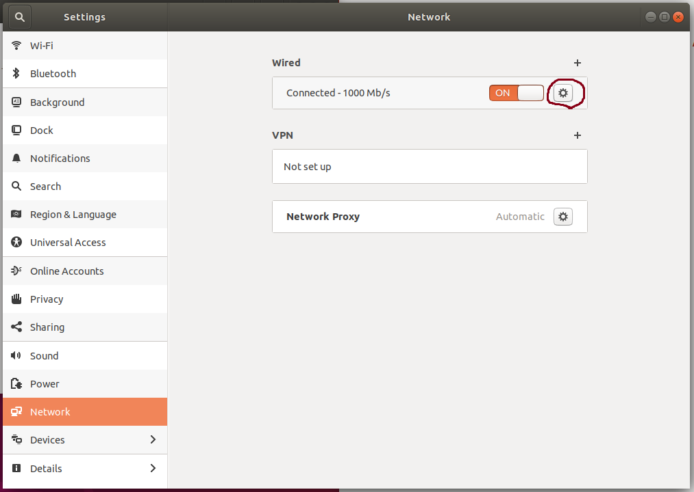
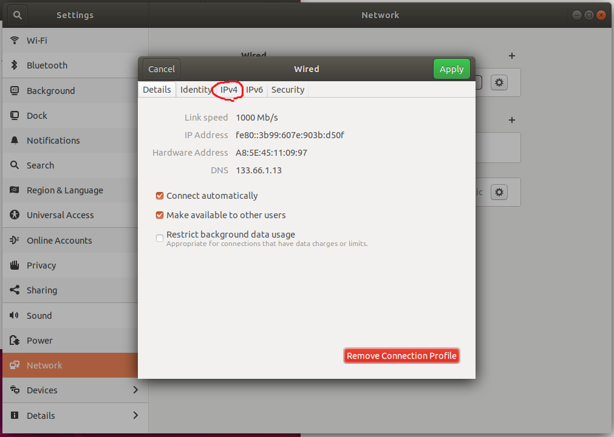
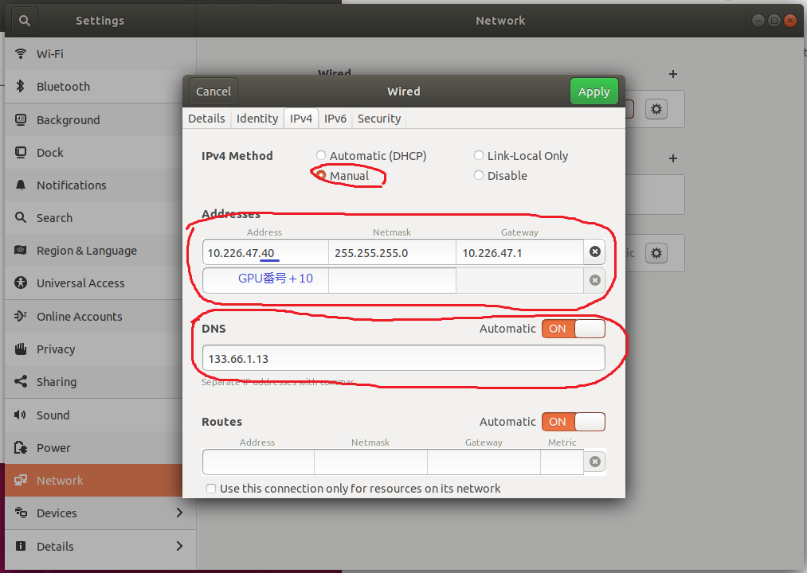

# セットアップ手順

```
sudo bash setup.sh
```
出てくる選択肢に y を打つ
sshdのサービスを再起動，マウント，FSアドレス書き込み，マウント実行，シンボリックリンク作成

# アドレスを設定

赤色の部分を入力



アドレスは10.226.47.GPU番号+10



再起動

sshとnvidia-smiができるかを確認

## この後は各自dockerを作るだけ
20.04のDocker fileのサンプル：
[jikuya_docker_setup_20.04](http://10.226.47.83:8080/jikuya/jikuya_docker_setup_20.04)